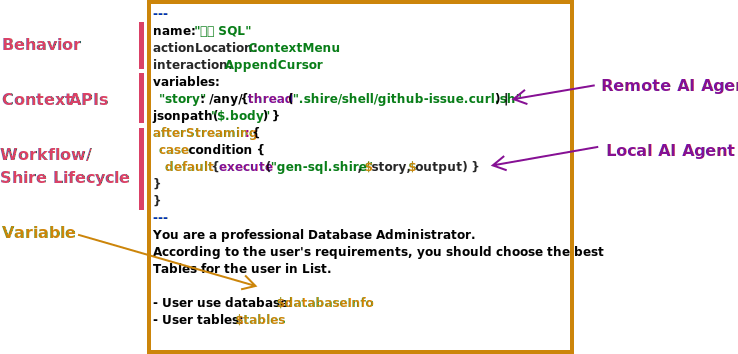

  

<h1 align="center">Shire - AI Coding & Agents Language</h1>

  
  
  

Shire offers a straightforward AI Coding & Agents Language
that enables communication between an LLM and control IDE for automated programming.

> The concept of Shire originated from [AutoDev](https://github.com/unit-mesh/auto-dev), a subproject
> of [UnitMesh](https://unitmesh.cc/). In AutoDev, we designed an AI-driven IDE for developers that includes DevIns, the
> precursor to Shire. DevIns aims to enable users to create AI agents tailored to their own IDEs, allowing them to build
> their customized AI-driven development environments.

Shire example:

Shire Data Architecture:

Documentation: [Shire AI Coding & Agents Language](https://shire.phodal.com/)

## LICENSE

This code is distributed under the MPL 2.0 license. See `LICENSE` in this directory.
